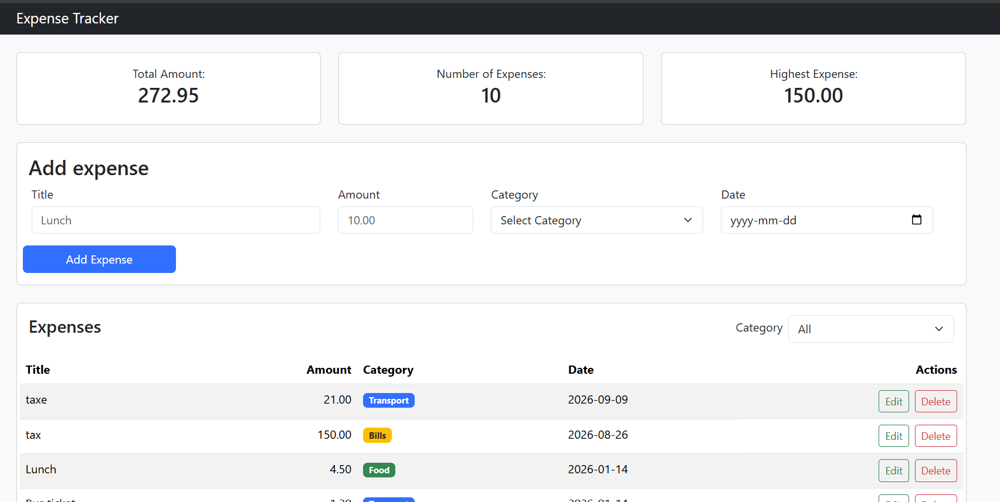
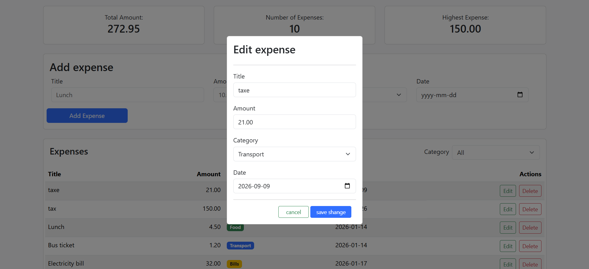

# Expense Tracker

**the main Goul :** 
Expense Tracker is a web app for recording and managing expenses. to help
the user to follow up his Expense


## How to run

<!-- Write the exact steps someone needs to run your project from scratch.
     Assume they have Node.js, PostgreSQL, and VS Code, and nothing else.
     Include: creating the database, running schema.sql, writing the .env file,
     starting the backend, and opening the frontend. -->

**Backend**

1. Create a PostgreSQL database:
     use folder **schema.sql** and run it 
2. create a .env file and fill it with your data
3. move to backend directory from your terminal
     ```cd backend ```
4. run this command ```node server.js ``` to run the back end  

**Frontend**
1. you just run it useing liveServer you wannat 

## Features

<!-- List what your app can do. Tick what you finished. -->

- [ ] Add an expense (with validation)
- [ ] Delete an expense
- [ ] Edit an expense
- [ ] Filter by category
- [ ] Summary cards (total, count, highest)
- [ ] Data is saved in a PostgreSQL database


## Screenshots
**Main Page**
<p>
  
</P>

**Edit Form**
<P>
  
</P>


## What was the hardest part?
**Backend**

**FrontEnd**